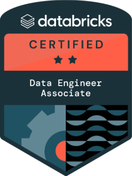
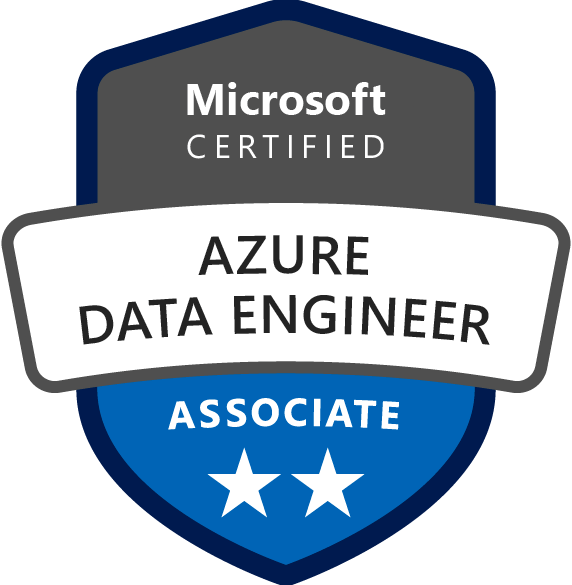
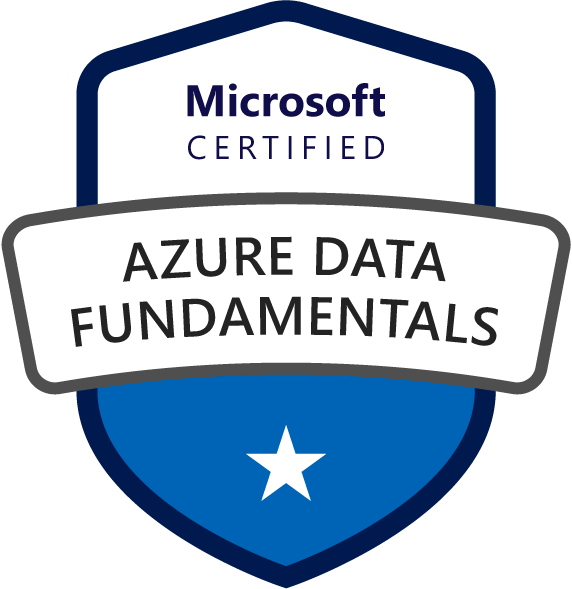
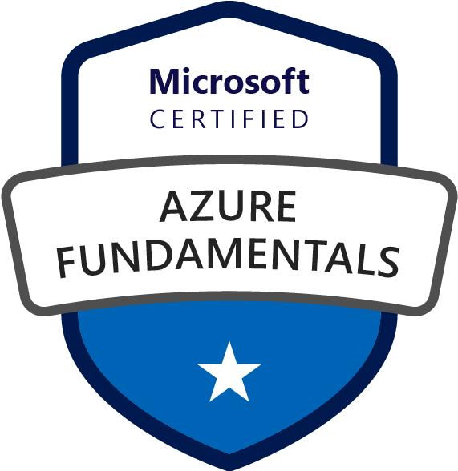
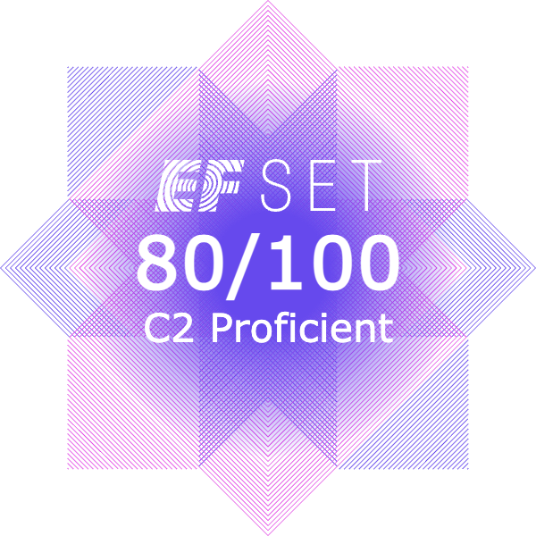

    

# 👋 Hi, I'm Valentino

As a **Data Engineer** with strong skills in Python, SQL, Azure and Databricks, I'm passionate about working as a team to develop innovative and scalable data solutions that can make a difference.

For me, continuous learning and professional growth are essential. I'm always looking for new opportunities to learn and improve my skills.

I'm an assertive and ambitious person who always seeks to challenge himself to achieve the best results in each project in which I participate.

## 🏆 Certifications

  
  &nbsp;&nbsp;&nbsp;&nbsp;
  
  &nbsp;&nbsp;&nbsp;&nbsp;
  
  &nbsp;&nbsp;&nbsp;&nbsp;
  
  &nbsp;&nbsp;&nbsp;&nbsp;
  

## 💼 What I Do

- Design and build **ETL/ELT pipelines**
- Work with **relational and non-relational databases**
- Automate workflows and data ingestion processes
- Optimize data storage and access patterns
- Develop cloud-native solutions on **Azure** (also familiar with AWS)

## ⚙️ Tech Stack

| Area              | Tools & Technologies |
|-------------------|----------------------|
| Programming       | Python, SQL    |
| Data Engineering  | Databricks, Spark, Pandas, DBT |
| Databases         | SQL Server, PostgreSQL, MySQL, Redis, MongoDB, Cosmos DB |
| Cloud & Storage   | Azure (Data Lake, Synapse, SQL DB), AWS S3 |
| Orchestration     | Airflow, Azure Data Factory |
| DevOps / Infra    | Docker, GitHub Actions, Azure DevOps |

## 📂 Featured Projects

## 📫 Let's Connect

- LinkedIn: [Valentino Muchino](https://www.linkedin.com/in/valentinomuchino/)
<!-- - Portfolio / Blog: [your-site] -->
- Email: valentinogrowth@gmail.com